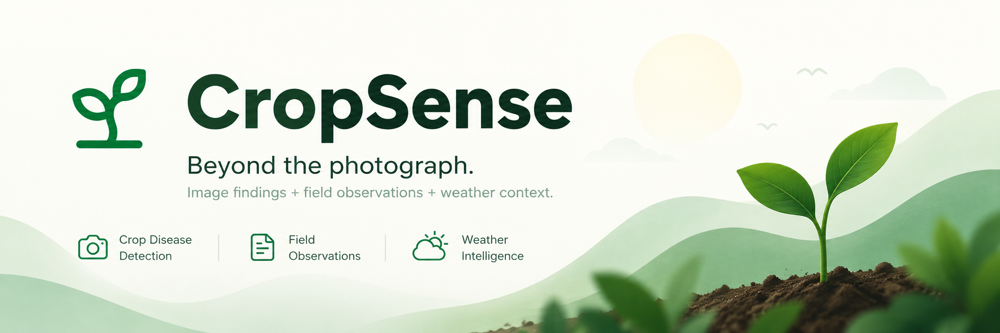

<div align="center">

  <!-- Project Banner -->
  

  <br/><br/>

  <h1>🌱 CropSense</h1>
  <p><b>CropSense is an AI-powered crop health platform that combines crop images, weather data, and farmer field observations to identify possible causes of crop stress and provide explainable, context-aware advisories.</b></p>

  <!-- Status Badges -->
  <a href="LICENSE"></a>
  
  

  <br/><br/>

  <!-- Key Tech Badges -->
  
  
  
  
  

  <br/><br/>

  <p align="center">
    CropSense combines <b>crop foliage images</b>, <b>real-time weather data</b>, and <b>farmer field observations</b> to identify crop-health issues and provide explainable, context-aware agricultural guidance.
  </p>

</div>

---

## 🔄 Diagnostic Workflow

```text
Crop Image + Weather + Field Observations ──► AI Analysis ──► Evidence Fusion ──► Assessment ──► Advisory
```

---

## 🏗️ System Architecture

```text
+---------------------------------------------------------------------------------+
|                                CropSense System                                 |
|                                                                                 |
|  +-------------------+     +-------------------+     +-----------------------+  |
|  |  Frontend Client  |     |  FastAPI Backend  |     |   External Services   |  |
|  | (Next.js 14 App)  |<--->|   (Python 3.13)   |<--->| * Open-Meteo API      |  |
|  +-------------------+     +---------+---------+     | * Supabase Storage    |  |
|                                      |               | * Supabase PostgreSQL |  |
|                                      v               +-----------------------+  |
|                            +-------------------+                                |
|                            |  EfficientNet-B0  |                                |
|                            |   & Rule Engine   |                                |
|                            +-------------------+                                |
+---------------------------------------------------------------------------------+
```

---

## 🛠️ Tech Stack & Architecture Details

### 🎨 Frontend Layer

- **Framework:** Next.js 14 (App Router)
- **UI Library:** React 18
- **Styling:** Tailwind CSS (custom restrained agricultural color palette)
- **Language:** TypeScript
- **Icons:** Lucide React

---

### ⚡ Backend API Layer

- **Language:** Python 3.13
- **Framework:** FastAPI (asynchronous REST API)
- **Server:** Uvicorn (ASGI web server)
- **Data Validation:** Pydantic (type validation & schema enforcement)
- **HTTP Client:** HTTPX (asynchronous REST calls to weather services)
- **File Uploads:** `python-multipart`

---

### 🧠 Computer Vision & AI Engine

- **Deep Learning Framework:** PyTorch 2.14 & Torchvision
- **Model Architecture:** **EfficientNet-B0** fine-tuned on tomato health/disease classes
- **Pretrained Weights:** ImageNet (`EfficientNet_B0_Weights.DEFAULT`)
- **Computer Vision & Quality Checking:**
  - **OpenCV (`opencv-python-headless`):** Laplacian variance for blur detection, mean grayscale intensity and pixel histograms for dark/overexposed image validation
  - **Pillow (PIL):** Image manipulation and preprocessing pipelines

---

### 🌤️ Weather Context Integration

- **Live Weather Data:** **Open-Meteo API** (retrieves live temperature, relative humidity, precipitation, and past 72h rainfall accumulation)
- **Location Geocoding:** **Open-Meteo Geocoding API** (resolves location searches like Pune, Mumbai, Delhi to exact latitude and longitude coordinates)

---

### 🗄️ Database & Object Storage

- **Production Database:** **Supabase PostgreSQL**
- **Object Storage:** **Supabase Storage** (`crop-images` public bucket for uploaded foliage photos)
- **Local Fallback Database:** Embedded **SQLite** (`crop_sense.db`) with local file server storage

---

## 🌾 Context Reasoning Engine (CropSense USP)

CropSense uses a custom Python Agronomic Weighted Rule & Evidence Engine to combine visual AI detections with environmental and field factors.

### 📐 Evidence Fusion Formula

$$\text{Final Support} = 0.65 \cdot P_{\text{Visual AI}} + 0.35 \cdot S_{\text{Contextual Evidence}}$$

- **Rule-Based Agronomic Logic:** Links disease pathogens (*Late Blight*, *Early Blight*, *Leaf Mold*) to relative humidity thresholds, soil moisture persistence, irrigation methods, insect pest vectors, and growth canopy stages.

---

## 📸 Screenshots & Prototype Demo

| Crop Assessment & Analysis | Weather & Field Context View |
| :---: | :---: |
|  |  |

---

## 🛠️ Local Setup & Running Guide

### Prerequisites

Make sure you have the following installed on your machine:

- **Node.js** (v18 or higher) & `npm`
- **Python** 3.10+ (3.13 recommended)
- **Git**

---

### 1. Clone the Repository

```bash
git clone https://github.com/your-username/CropSense.git
cd CropSense
```

---

### 2. Backend Setup (FastAPI)

Open a terminal window and navigate to the backend folder:

```bash
cd backend

# Create a Python virtual environment
python -m venv venv

# Activate the virtual environment
# Windows (Command Prompt / PowerShell):
venv\Scripts\activate
# macOS / Linux:
source venv/bin/activate

# Install required Python packages
pip install -r requirements.txt

# Start the FastAPI server with live reloading
uvicorn main:app --reload
```

The backend server will start running at `http://127.0.0.1:8000`. You can test the interactive API documentation at `http://127.0.0.1:8000/docs`.

---

### 3. Frontend Setup (Next.js 14)

Open a new terminal window and navigate to the frontend folder:

```bash
cd frontend

# Install Node dependencies
npm install

# Start the Next.js development server
npm run dev
```

Open `http://localhost:3000` in your web browser to view and interact with the CropSense platform!

---

## 🎯 Current Prototype Scope

The Round-1 prototype focuses on **Tomato Crop Health Assessment**, featuring:

- Real foliage image analysis with automated quality checks (blur and lighting)
- Live local weather integration via the Open-Meteo API
- Dynamic context-aware reassessment:
  - Same image + new weather context → updated assessment & advisory
- Storage for diagnostic history and images via Supabase

---

## 🚀 Future Scope

- 🌾 **Multi-Crop Support:** Expanding deep learning models beyond tomatoes to maize, potato, and rice crops
- 🛰️ **IoT Soil Sensing:** Integrating live NPK, soil moisture, and pH sensor feeds
- 🌐 **Multilingual Advisory:** Voice and text support for regional languages
- 👨‍🌾 **Expert Community Network:** In-app escalation to certified agricultural extension officers